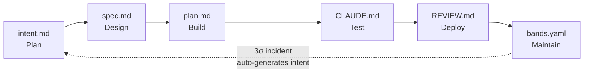

# loshu-sdlc

> AI-Native Software Development Lifecycle plugin for Claude Code.

[](https://github.com/loshu89/loshu-sdlc/actions/workflows/ci.yml)
[](https://github.com/loshu89/loshu-sdlc/actions/workflows/publish-ghcr.yml)
[](LICENSE)
[](https://github.com/orgs/loshu89/packages)

[English](README.md) · [简体中文](README.zh-CN.md)

loshu-sdlc turns every change into a version-controlled, schema-validated, hook-enforced artifact (`intent.md → spec.md → plan.md → CLAUDE.md → REVIEW.md → bands.yaml`), and **closes the loop** by turning production incidents back into new intent documents.

## Why loshu-sdlc?

- **Artifacts over chat.** Every stage produces a file. Decisions are auditable, reviewable, replayable — not lost in a chat scrollback.
- **Closed feedback loop.** A 3σ production incident auto-generates a new `intent.md`; the cycle restarts; the fix flows through the same gates as any other change. No separate hot-fix process.
- **Thin by design.** Orchestrates existing tools (`superpowers:*`, `ui-ux-pro-max`, `ecc:*`) and ships only what's SDLC-specific.

## The six stages



| Stage | Slash command | Output |
|---|---|---|
| **Plan** | `/sdlc-plan` | `intent.md` |
| **Design** | `/sdlc-design` | `spec.md` |
| **Build** | `/sdlc-build` | `plan.md` + `CLAUDE.md` + code |
| **Test** | `/sdlc-test` | verification block (build / test / lint / typecheck) |
| **Deploy** | `/sdlc-deploy` | `REVIEW.md` |
| **Maintain** | `/sdlc-maintain` | `bands.yaml` evaluation + auto-generated incident intents |

## Quickstart

Five commands, ten minutes:

```bash
# 1. Scaffold a new project (with the optional ui-ux and ecc plugins)
npx create-loshu-sdlc-app my-app --with-ux --with-ecc
cd my-app

# 2. Capture your first intent (brainstorms with you, then writes intent.md)
/sdlc-plan

# 3. Continue through the stages
/sdlc-design    # → spec.md
/sdlc-build     # → plan.md + CLAUDE.md
/sdlc-test      # → verification block + evals
/sdlc-deploy    # → REVIEW.md
/sdlc-maintain  # → bands.yaml + monitoring

# Check progress anytime
/sdlc-status
```

> If `npx` 404s on `create-loshu-sdlc-app`, the package may not yet be on the public npm registry — see [installation.md → Install from GitHub Packages](docs/installation.md#install-from-github-packages-advanced) for the alternative.

See **[Getting started](docs/getting-started.md)** for a full walkthrough that builds a real project end-to-end.

## Choose your path

| I want to... | Read |
|---|---|
| Install loshu-sdlc (scaffold, plugin-only, or GitHub Packages) | **[installation.md](docs/installation.md)** |
| Walk through an example end-to-end | **[getting-started.md](docs/getting-started.md)** |
| Use it day-to-day (slash commands, CLI, hooks, artifacts) | **[usage-guide.md](docs/usage-guide.md)** |
| Contribute to loshu-sdlc itself | **[contributing.md](docs/contributing.md)** |
| Release a version, manage dependabot, regenerate eval goldens | **[maintenance.md](docs/maintenance.md)** |

## Required external plugins

loshu-sdlc depends on one external plugin set (Tier 1) and strongly recommends another (Tier 2). **Without Tier 1, loshu-sdlc refuses to run.**

- **Tier 1 (required):** `superpowers:*` — provides the brainstorming, writing-plans, TDD, and verification skills.
- **Tier 2 (recommended):** `ui-ux-pro-max` and `ecc:*` — design intelligence and code-review skills.

See **[installation.md → Required external plugins](docs/installation.md#required-external-plugins)** for the install commands.

## Packages

| Package | Published as | Purpose |
|---|---|---|
| `@loshu89/plugin` | GitHub Packages | The Claude Code plugin — slash commands, agents, skills, hooks, schemas |
| `@loshu89/cli` | GitHub Packages | Scaffolder (`create-loshu-sdlc-app`) + maintenance CLI (`loshu-sdlc`) |
| `@loshu89/templates` | GitHub Packages | Starter templates consumed by the scaffolder |

## Troubleshooting

- **`✔ Tier-1 dep missing`** — install superpowers (see [installation.md](docs/installation.md#tier-1--required)). Without it, loshu-sdlc refuses to run.
- **Hook blocked my edit** — hooks use `exit 2` with a reason on stderr. Read the message, fix, retry.
- **Plugin commands not appearing** — restart your Claude Code session after `claude plugin install`.
- **Scaffold creates project but hooks don't fire** — the scaffolder uses a symlink `.claude/hooks → .claude/plugins/loshu-sdlc/hooks/`. Some Windows filesystems don't support symlinks; copy the `hooks/` directory manually as a workaround.
- **GitHub Packages publish fails with E401** — usually an org-level third-party app restriction. Approve the GitHub Actions app, or use a PAT added as `GHCR_TOKEN`.

For everything else, see [usage-guide.md → Hooks](docs/usage-guide.md#hooks) and [maintenance.md](docs/maintenance.md).

## License

MIT © loshu-sdlc contributors

Third-party content (palettes, typography, accessibility, coding standards, security baselines) is borrowed from `ui-ux-pro-max` and `ecc` under their respective licenses — see [`LICENSE-THIRD-PARTY.md`](LICENSE-THIRD-PARTY.md).

---

[Anthropic AI-Native SDLC Playbook](https://claude.com/blog/the-ai-native-sdlc-playbook) · [GitHub Packages](https://github.com/orgs/loshu89/packages) · [Issues](https://github.com/loshu89/loshu-sdlc/issues)