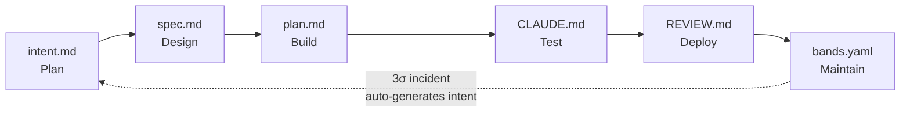

# loshu-sdlc

> 面向 Claude Code 的 AI-Native 软件开发生命周期插件。

[](https://github.com/loshu89/loshu-sdlc/actions/workflows/ci.yml)
[](https://github.com/loshu89/loshu-sdlc/actions/workflows/publish-ghcr.yml)
[](LICENSE)
[](https://github.com/orgs/loshu89/packages)

[English](README.md) · [简体中文](README.zh-CN.md)

loshu-sdlc 把每一次改动都转成版本受控、Schema 校验、Hook 强制的制品（`intent.md → spec.md → plan.md → CLAUDE.md → REVIEW.md → bands.yaml`），并通过把生产事故回写成新的 `intent.md` 来**闭合循环**。

## 为什么用 loshu-sdlc？

- **制品优先于对话**。每个阶段都产出版本受控的文件。决策可审计、可回顾、可重放——不会消失在聊天滚动条里。
- **闭环反馈**。3σ 生产事故自动生成新的 `intent.md`，循环重启，修复走和其他改动一样的关卡。不需要单独的 hot-fix 流程。
- **保持精薄**。编排外部成熟技能（`superpowers:*`、`ui-ux-pro-max`、`ecc:*`），只自研真正属于 SDLC 的部分。

## 六阶段



| 阶段 | 斜杠命令 | 产出 |
|---|---|---|
| **Plan** | `/sdlc-plan` | `intent.md` |
| **Design** | `/sdlc-design` | `spec.md` |
| **Build** | `/sdlc-build` | `plan.md` + `CLAUDE.md` + 代码 |
| **Test** | `/sdlc-test` | verification block（build / test / lint / typecheck） |
| **Deploy** | `/sdlc-deploy` | `REVIEW.md` |
| **Maintain** | `/sdlc-maintain` | `bands.yaml` 评估 + 自动生成事故 intent |

## 快速上手

五个命令，十分钟：

```bash
# 1. 脚手架新建项目（同时装 ui-ux 和 ecc 是可选的）
npx create-loshu-sdlc-app my-app --with-ux --with-ecc
cd my-app

# 2. 捕获你的第一个 intent（与 Claude 头脑风暴后写入 intent.md）
/sdlc-plan

# 3. 继续走完各阶段
/sdlc-design    # → spec.md
/sdlc-build     # → plan.md + CLAUDE.md
/sdlc-test      # → verification block + evals
/sdlc-deploy    # → REVIEW.md
/sdlc-maintain  # → bands.yaml + 监控

# 随时查看进度
/sdlc-status
```

完整走一个真实项目的教程见 **[快速上手](docs/getting-started.zh-CN.md)**。

## 选择你的路径

| 我想... | 阅读 |
|---|---|
| 安装 loshu-sdlc（脚手架 / 仅插件 / GitHub Packages） | **[installation.zh-CN.md](docs/installation.zh-CN.md)** |
| 跟着端到端示例走一遍 | **[getting-started.zh-CN.md](docs/getting-started.zh-CN.md)** |
| 日常使用（斜杠命令、CLI、Hook、制品） | **[usage-guide.zh-CN.md](docs/usage-guide.zh-CN.md)** |
| 为 loshu-sdlc 本身做贡献 | **[contributing.zh-CN.md](docs/contributing.zh-CN.md)** |
| 发布版本、管理 dependabot、重生成 eval golden | **[maintenance.zh-CN.md](docs/maintenance.zh-CN.md)** |

## 必需的外部插件

loshu-sdlc 依赖一套外部插件（Tier 1，必需）和强烈推荐另一套（Tier 2）。**没有 Tier 1，loshu-sdlc 拒绝运行。**

- **Tier 1（必需）：** `superpowers:*` —— 提供 brainstorming、writing-plans、TDD、verification 等技能。
- **Tier 2（推荐）：** `ui-ux-pro-max` 和 `ecc:*` —— 设计智能和代码评审技能。

安装命令见 **[installation.zh-CN.md → 必需的外部插件](docs/installation.zh-CN.md#必需的外部插件)**。

## 包

| 包 | 发布到 | 用途 |
|---|---|---|
| `@loshu89/plugin` | GitHub Packages | Claude Code 插件——斜杠命令、agents、skills、hooks、schemas |
| `@loshu89/cli` | GitHub Packages | 脚手架（`create-loshu-sdlc-app`）+ 维护 CLI（`loshu-sdlc`） |
| `@loshu89/templates` | GitHub Packages | 脚手架消费的起始模板 |

## 故障排查

- **`✔ Tier-1 dep missing`** —— 安装 superpowers（见 [installation.zh-CN.md](docs/installation.zh-CN.md#必需的外部插件)）。没有它 loshu-sdlc 拒绝运行。
- **Hook 阻止了我的编辑** —— Hook 用 `exit 2` 阻止并在 stderr 给出具体原因。读消息、修复、然后重试。
- **Claude Code 里看不到插件命令** —— 通过 `claude plugin install loshu-sdlc@loshu-sdlc` 安装后，重启 Claude Code 会话。斜杠命令在会话开始时发现。
- **脚手架创建了项目但 Hook 不触发** —— 脚手架创建符号链接 `.claude/hooks → .claude/plugins/loshu-sdlc/hooks/`。如果文件系统不支持符号链接（某些 Windows 配置），Hook 不会触发。解决方案：脚手架完成后手动复制 `hooks/` 目录。
- **GitHub Packages 发布失败 E401** —— 几乎总是组织的第三方应用限制。两种解决方法：在组织设置 → 第三方访问 → 批准 GitHub Actions 应用；或使用 PAT（作为 `GHCR_TOKEN` secret 添加）。

其他问题见 [usage-guide.zh-CN.md → Hooks](docs/usage-guide.zh-CN.md#hooks) 和 [maintenance.zh-CN.md](docs/maintenance.zh-CN.md)。

## 许可证

MIT © loshu-sdlc contributors

第三方内容（配色、排版、可访问性、编码标准、安全基线）借用自 `ui-ux-pro-max` 和 `ecc`，遵循各自的许可证——见 [`LICENSE-THIRD-PARTY.md`](LICENSE-THIRD-PARTY.md)。

---

[Anthropic AI-Native SDLC Playbook](https://claude.com/blog/the-ai-native-sdlc-playbook) · [GitHub Packages](https://github.com/orgs/loshu89/packages) · [Issues](https://github.com/loshu89/loshu-sdlc/issues)