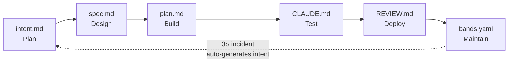

# Usage guide

Reference documentation for loshu-sdlc. Read this when you need to know exactly what a command does, what an artifact looks like, or how a hook behaves.

If you're new to loshu-sdlc, start with [getting-started.md](getting-started.md) instead — it's a tutorial.

---

## Contents

- [The six stages](#the-six-stages)
  - [Plan](#plan)
  - [Design](#design)
  - [Build](#build)
  - [Test](#test)
  - [Deploy](#deploy)
  - [Maintain](#maintain)
- [Slash commands](#slash-commands)
- [CLI commands](#cli-commands)
- [Hooks](#hooks)
- [The artifact chain](#the-artifact-chain)
- [Acceptance testing](#acceptance-testing)

---

## The six stages

loshu-sdlc implements the six-stage AI-Native SDLC. Each stage produces one version-controlled artifact and is gated by a hook.

### Plan

**What it does.** Drives a brainstorming dialogue with Claude, then writes `intent.md` capturing the agreed problem, proposed outcome, scope, and open questions.

**When to use it.** At the start of any change — a feature, a refactor, an incident fix, even a docs update.

**Artifact.** `intent.md` with frontmatter:

```yaml
---
id: plan-c01-todos-cli-7f3a-01HXYZABCDEFGHJKMNPQRSTWX
schema_version: 0.5.0
cycle_id: 1
stage: plan
state: accepted         # captured → accepted
created_by: human:you
created_at: 2026-09-30T10:00:00Z
parent_ids: []
---

# Title

## Problem
...
## Proposed outcome
...
## Out of scope
...
## Open questions
...
```

The ULID-format `id` makes every artifact uniquely traceable. Format: `stage-c##-slug-####-ULID`.

**Slash command:** `/sdlc-plan`
**CLI command:** none (artifact creation is interactive)
**Hook:** `plan-exit` validates `intent.md` against `intent.schema.json`

### Design

**What it does.** Reads `intent.md` and produces `spec.md` — a formal specification with inputs/outputs, data model, error handling, and acceptance criteria.

**When to use it.** Once `intent.md` is `accepted`. The hook refuses to design against a captured-but-not-accepted one.

**Slash command:** `/sdlc-design`
**Hook:** `design-exit` validates `spec.md` and checks `intent.md` is `accepted`

### Build

**What it does.** Reads `spec.md`, writes `plan.md` (the implementation steps), implements the code following the plan in TDD style, and writes a `CLAUDE.md` for the project containing the verification block.

**When to use it.** After `spec.md` is `accepted`. The build itself is the longest stage — `/sdlc-build` may take many minutes.

**Slash command:** `/sdlc-build`
**Hook:** `build-exit` validates `plan.md` and confirms `CLAUDE.md` contains the verification block

### Test

**What it does.** Runs the verification block in `CLAUDE.md` — `pnpm build`, `pnpm typecheck`, `pnpm test`, `pnpm lint` — all must exit 0. The hook re-runs the same block independently.

**When to use it.** After `/sdlc-build` completes. Re-run anytime you want a CI-equivalent gate locally.

**Slash command:** `/sdlc-test`
**Hook:** `test-exit` re-runs the verification block and fails on any non-zero exit

### Deploy

**What it does.** Writes `REVIEW.md` covering security, compliance, performance, and acceptance summary. You read it and sign off (or push back).

**When to use it.** After the test stage passes. Any section with `status: fail` blocks the deploy.

**Slash command:** `/sdlc-deploy`
**Hook:** `deploy-exit` validates `REVIEW.md`; blocks on `status: fail` in any section

### Maintain

**What it does.** Evaluates `bands.yaml` against current metrics. If any metric is in 3σ breach, it auto-invokes `loshu-sdlc maintain diagnose` (10-second timeout) to synthesize an incident `intent.md` — closing the loop from production back to plan.

**When to use it.** Anytime after deploy. Set up `bands.yaml` once you've shipped something you want to monitor.

**Slash command:** `/sdlc-maintain`
**Hook:** `maintain-exit` validates `bands.yaml`; on 3σ breach, calls `loshu-sdlc maintain diagnose` with a 10s timeout and falls back to "block and tell user to run `/sdlc-maintain`" on failure

**Loop closure is the headline feature.** See [`getting-started.md`](getting-started.md#7-stage-6--maintain-sdlc-maintain) for the full loop diagram.

---

## Slash commands

Once the plugin is installed, you have nine slash commands.

| Command | Stage | Purpose |
|---|---|---|
| `/sdlc-plan` | Plan | Brainstorm and write `intent.md` |
| `/sdlc-design` | Design | Translate intent into `spec.md` |
| `/sdlc-build` | Build | Generate `plan.md` and scaffold `CLAUDE.md`; implement code |
| `/sdlc-test` | Test | Run the verification block (build / typecheck / test / lint) |
| `/sdlc-deploy` | Deploy | Populate `REVIEW.md` with security + compliance checks |
| `/sdlc-maintain` | Maintain | Evaluate `bands.yaml`; auto-generate incident `intent.md` on 3σ |
| `/sdlc-status` | (meta) | Show current cycle state |
| `/sdlc-init` | (meta) | Run plan → design → build in sequence |
| `/sdlc-help` | (meta) | Show command reference |

---

## CLI commands

`loshu-sdlc` ships with maintenance commands that you can also run directly from the terminal (no slash command needed).

### Project lifecycle

| Command | What it does |
|---|---|
| `loshu-sdlc create [path]` | Scaffold a new SDLC project |
| `loshu-sdlc doctor [path]` | Health-check an SDLC project (`✔ All checks passed`) |
| `loshu-sdlc status [path]` | Render per-stage status table |
| `loshu-sdlc upgrade [path]` | Bump loshu-sdlc version pins in `package.json` |
| `loshu-sdlc migrate <file>` | Migrate an artifact to current schema (`--check`, `--dry-run`, `--from`, `--to`) |
| `loshu-sdlc repair <file>` | Regenerate missing `id`, fill required fields |

### Artifact validation

| Command | What it does |
|---|---|
| `loshu-sdlc validate <artifact> <file>` | Validate an artifact (intent, spec, plan, etc.) against its JSON schema |
| `loshu-sdlc test [file]` | Run 4-layer acceptance tests (`--strict`, `--fix`, `--reporter text\|json\|junit`) |

### Bands (metrics + incident detection)

| Command | What it does |
|---|---|
| `loshu-sdlc bands evaluate <file>` | Evaluate `bands.yaml` against current metrics |
| `loshu-sdlc bands diagnose <file>` | Extract 3σ breaches as structured JSON |
| `loshu-sdlc bands record <project> --metric <m> --value <v>` | Record a metric value |

### Maintain (loop closure)

| Command | What it does |
|---|---|
| `loshu-sdlc maintain diagnose --bands <file> --output <file>` | Synthesize incident `intent.md` from breach data (invoked automatically by `maintain-exit`; can be called manually) |

### Quality and rules

| Command | What it does |
|---|---|
| `loshu-sdlc lint [path]` | Lint borrowed plugin skills (`--fix`) |
| `loshu-sdlc rules list\|check` | Inspect the rule registry |
| `loshu-sdlc coverage [path]` | Run coverage and emit a JSON report |

### Git lifecycle (v0.6.0+)

| Command | What it does |
|---|---|
| `loshu-sdlc git sync` | Sync with platform (GitHub / GitLab) |
| `loshu-sdlc git status` | Show platform sync status (read-only, no token needed) |
| `loshu-sdlc git merge` | Merge a PR |
| `loshu-sdlc git abandon` | Abandon a cycle (close PR, mark abandoned) |

### Misc

| Command | What it does |
|---|---|
| `loshu-sdlc logs` | Read `~/.loshu-sdlc/logs/*.log` |
| `loshu-sdlc telemetry` | Toggle telemetry in `~/.loshu-sdlc/config.json` |
| `loshu-sdlc help [command]` | Show help for any command |

---

## Hooks

Hooks fire at stage transitions to enforce the artifact chain. They use `exit 0` (allow) / `exit 2` (block) semantics.

| Hook | When | What it does |
|---|---|---|
| `plan-exit` | After `/sdlc-plan` writes `intent.md` | Validates against `intent.schema.json` |
| `design-exit` | After `/sdlc-design` writes `spec.md` | Validates `spec.md`; ensures `intent.md` is `accepted` |
| `build-exit` | After `/sdlc-build` writes `plan.md` | Validates `plan.md`; ensures `CLAUDE.md` has the verification block |
| `test-exit` | After `/sdlc-test` | Runs the verification block (build / test / lint / typecheck must all exit 0) |
| `deploy-exit` | After `/sdlc-deploy` writes `REVIEW.md` | Validates `REVIEW.md`; blocks on `status: fail` in any section |
| `maintain-exit` | After `/sdlc-maintain` | Validates `bands.yaml`; on 3σ incidents, auto-invokes `loshu-sdlc maintain diagnose` (10s timeout) to write a stub `intent.md` — falls back to "block and tell user to run `/sdlc-maintain`" on failure |
| `protect-artifacts` | On any Write/Edit tool call | Allow-all stub; reserved for future artifact protection |

When a hook blocks, it prints the specific reason to stderr. Read the message, fix the issue, retry.

---

## The artifact chain

Each stage produces a version-controlled artifact. Together they form an auditable decision trail — all artifacts live in git history.



Each artifact has a JSON schema in `packages/plugin/schemas/`. `loshu-sdlc validate <artifact> <file>` runs the schema check.

### Artifact identity

Every artifact carries a ULID-format slug in its YAML frontmatter:

```yaml
id: spec-c03-oauth-7f3a-01HXYZABCDEFGHJKMNPQRSTWX
```

Format: `stage-c##-slug-####-ULID` where:
- `stage` is one of `plan|design|build|test|deploy|maintain`
- `c##` is the zero-padded cycle number
- `slug` is a kebab-case hint (max 30 chars)
- `####` is 4 hex chars (collision absorption)
- The final 26-char ULID is time-ordered

Run `loshu-sdlc repair <file>` to regenerate any missing fields.

---

## Acceptance testing

`loshu-sdlc test` runs 4 layers of acceptance assertions on the SDLC artifacts themselves (distinct from running the project's tests):

```bash
loshu-sdlc test                 # all artifacts, all 4 layers
loshu-sdlc test intent.md       # single file
loshu-sdlc test --layer 2       # only per-artifact assertions
loshu-sdlc test --strict        # exit 1 on any failure
loshu-sdlc test --fix           # auto-apply fixable items
loshu-sdlc test --reporter junit > results.xml
```

Layers:

1. **Field-level** — every required field is present and well-formed (assertions A1–A8)
2. **Per-artifact** — schema validates; version is current; state is in the allowed enum (V1–V4, C1–C4)
3. **Cross-artifact** — `parent_ids` resolve; git refs match platform state (C5–C9)
4. **End-to-end** — bands monotonic; metrics defined (B1–B2)

Use this to validate that your SDLC artifacts are well-formed before each release.