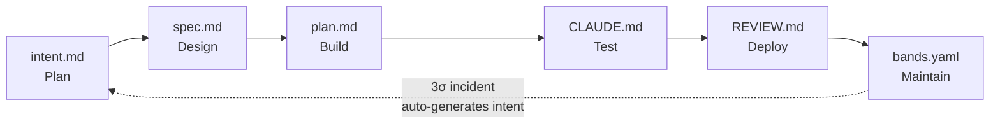

# 使用指南

> [English](usage-guide.md) · [简体中文](usage-guide.zh-CN.md)

loshu-sdlc 的参考文档。当你需要准确了解某个命令的用途、某个制品的形态、或某个 Hook 的行为时，请阅读本文。

如果你是第一次接触 loshu-sdlc，建议先看 [getting-started.zh-CN.md](getting-started.zh-CN.md) —— 那是一份教程。

---

## 目录

- [六个阶段](#六个阶段)
  - [Plan](#plan)
  - [Design](#design)
  - [Build](#build)
  - [Test](#test)
  - [Deploy](#deploy)
  - [Maintain](#maintain)
- [斜杠命令](#斜杠命令)
- [CLI 命令](#cli-命令)
- [Hooks](#hooks)
- [制品链](#制品链)
- [验收测试](#验收测试)

---

## 六个阶段

loshu-sdlc 实现的是六阶段 AI-Native SDLC。每个阶段产出一个版本受控的制品，并由一个 Hook 强制把关。

### Plan

**作用。** 与 Claude 进行头脑风暴对话，然后把达成一致的问题、预期结果、范围和未决问题写入 `intent.md`。

**何时使用。** 在任何改动的起点 —— 无论是新功能、重构、事故修复，还是文档更新。

**制品。** 带 frontmatter 的 `intent.md`：

```yaml
---
id: plan-c01-todos-cli-7f3a-01HXYZABCDEFGHJKMNPQRSTWX
schema_version: 0.5.0
cycle_id: 1
stage: plan
state: accepted         # captured → accepted
created_by: human:you
created_at: 2026-09-30T10:00:00Z
parent_ids: []
---

# 标题

## 问题
...
## 预期结果
...
## 不在范围内
...
## 未决问题
...
```

ULID 格式的 `id` 让每个制品都可唯一追溯。格式：`stage-c##-slug-####-ULID`。

**斜杠命令：** `/sdlc-plan`
**CLI 命令：** 无（制品的创建是交互式的）
**Hook：** `plan-exit` 依据 `intent.schema.json` 校验 `intent.md`

### Design

**作用。** 读取 `intent.md`，产出 `spec.md` —— 一份正式规约，包含输入输出、数据模型、错误处理和验收标准。

**何时使用。** 当 `intent.md` 状态为 `accepted` 时。Hook 会拒绝针对仅 `captured` 而未 `accepted` 的 `intent.md` 开展设计。

**斜杠命令：** `/sdlc-design`
**Hook：** `design-exit` 校验 `spec.md`，并检查 `intent.md` 处于 `accepted`

### Build

**作用。** 读取 `spec.md`，写出 `plan.md`（实施步骤），按 TDD 方式实现代码，并为项目编写包含 verification block 的 `CLAUDE.md`。

**何时使用。** `spec.md` 处于 `accepted` 之后。Build 本身是最长的阶段 —— `/sdlc-build` 可能需要数分钟。

**斜杠命令：** `/sdlc-build`
**Hook：** `build-exit` 校验 `plan.md`，并确认 `CLAUDE.md` 包含 verification block

### Test

**作用。** 执行 `CLAUDE.md` 中的 verification block —— `pnpm build`、`pnpm typecheck`、`pnpm test`、`pnpm lint` —— 所有命令必须退出码为 0。Hook 会独立重跑同一 block。

**何时使用。** `/sdlc-build` 完成后。随时可以重跑，作为本地等效 CI 关卡。

**斜杠命令：** `/sdlc-test`
**Hook：** `test-exit` 重跑 verification block，任何非 0 退出都会失败

### Deploy

**作用。** 编写 `REVIEW.md`，覆盖安全、合规、性能与验收总结。你阅读后签字放行（或提出修改）。

**何时使用。** Test 阶段通过之后。任何含 `status: fail` 的章节都会阻止部署。

**斜杠命令：** `/sdlc-deploy`
**Hook：** `deploy-exit` 校验 `REVIEW.md`；任何章节出现 `status: fail` 即阻止

### Maintain

**作用。** 基于当前指标评估 `bands.yaml`。若任一指标触发 3σ 越界，会自动调用 `loshu-sdlc maintain diagnose`（10 秒超时）合成一份事故 `intent.md` —— 由此把生产再回到 Plan 的闭环连接起来。

**何时使用。** 部署完成后任意时刻。在你想监控的产品上线后配置一次 `bands.yaml`。

**斜杠命令：** `/sdlc-maintain`
**Hook：** `maintain-exit` 校验 `bands.yaml`；3σ 越界时调用带 10 秒超时的 `loshu-sdlc maintain diagnose`，失败时回退为“阻止并提示用户运行 `/sdlc-maintain`”

**闭环是核心卖点。** 完整闭环图见 [`getting-started.zh-CN.md`](getting-started.zh-CN.md#7-stage-6--maintain-sdlc-maintain)。

---

## 斜杠命令

插件装好后，你拥有九个斜杠命令。

| 命令 | 阶段 | 用途 |
|---|---|---|
| `/sdlc-plan` | Plan | 头脑风暴并编写 `intent.md` |
| `/sdlc-design` | Design | 把 intent 翻译成 `spec.md` |
| `/sdlc-build` | Build | 生成 `plan.md` 和 `CLAUDE.md` 脚手架；实现代码 |
| `/sdlc-test` | Test | 执行 verification block（build / typecheck / test / lint） |
| `/sdlc-deploy` | Deploy | 在 `REVIEW.md` 中填入安全 + 合规检查 |
| `/sdlc-maintain` | Maintain | 评估 `bands.yaml`；3σ 时自动生成事故 `intent.md` |
| `/sdlc-status` | (meta) | 显示当前 cycle 状态 |
| `/sdlc-init` | (meta) | 按顺序执行 plan → design → build |
| `/sdlc-help` | (meta) | 显示命令参考 |

---

## CLI 命令

`loshu-sdlc` 附带一组维护命令，也可以直接在终端里调用（无需斜杠命令）。

### 项目生命周期

| 命令 | 作用 |
|---|---|
| `loshu-sdlc create [path]` | 为新项目脚手架出 SDLC 工程 |
| `loshu-sdlc doctor [path]` | 给 SDLC 项目做健康检查（`✔ All checks passed`） |
| `loshu-sdlc status [path]` | 按阶段输出状态表 |
| `loshu-sdlc upgrade [path]` | 更新 `package.json` 中的 loshu-sdlc 版本钉位 |
| `loshu-sdlc migrate <file>` | 将制品迁移到当前 schema（`--check`、`--dry-run`、`--from`、`--to`） |
| `loshu-sdlc repair <file>` | 重新生成缺失的 `id`，补齐必填字段 |

### 制品校验

| 命令 | 作用 |
|---|---|
| `loshu-sdlc validate <artifact> <file>` | 按 JSON schema 校验制品（intent、spec、plan 等） |
| `loshu-sdlc test [file]` | 运行 4 层验收测试（`--strict`、`--fix`、`--reporter text\|json\|junit`） |

### Bands（指标 + 事故检测）

| 命令 | 作用 |
|---|---|
| `loshu-sdlc bands evaluate <file>` | 基于当前指标评估 `bands.yaml` |
| `loshu-sdlc bands diagnose <file>` | 将 3σ 越界抽取为结构化 JSON |
| `loshu-sdlc bands record <project> --metric <m> --value <v>` | 记录一条指标值 |

### Maintain（闭环）

| 命令 | 作用 |
|---|---|
| `loshu-sdlc maintain diagnose --bands <file> --output <file>` | 由越界数据合成事故 `intent.md`（由 `maintain-exit` 自动调用；也可手动调用） |

### 质量与规则

| 命令 | 作用 |
|---|---|
| `loshu-sdlc lint [path]` | 对借用插件的技能做 lint（`--fix`） |
| `loshu-sdlc rules list\|check` | 查看规则注册表 |
| `loshu-sdlc coverage [path]` | 运行覆盖率并输出 JSON 报告 |

### Git 生命周期（v0.6.0+）

| 命令 | 作用 |
|---|---|
| `loshu-sdlc git sync` | 与平台（GitHub / GitLab）同步 |
| `loshu-sdlc git status` | 显示平台同步状态（只读，无需 token） |
| `loshu-sdlc git merge` | 合并一个 PR |
| `loshu-sdlc git abandon` | 放弃一个 cycle（关闭 PR，标记 abandoned） |

### 其他

| 命令 | 作用 |
|---|---|
| `loshu-sdlc logs` | 读取 `~/.loshu-sdlc/logs/*.log` |
| `loshu-sdlc telemetry` | 切换 `~/.loshu-sdlc/config.json` 中的遥测开关 |
| `loshu-sdlc help [command]` | 显示任意命令的帮助 |

---

## Hooks

Hook 在阶段切换时触发，用于强制制品链。它们使用 `exit 0`（放行）/ `exit 2`（阻止）语义。

| Hook | 时机 | 作用 |
|---|---|---|
| `plan-exit` | `/sdlc-plan` 写入 `intent.md` 之后 | 按 `intent.schema.json` 校验 |
| `design-exit` | `/sdlc-design` 写入 `spec.md` 之后 | 校验 `spec.md`；确保 `intent.md` 处于 `accepted` |
| `build-exit` | `/sdlc-build` 写入 `plan.md` 之后 | 校验 `plan.md`；确保 `CLAUDE.md` 包含 verification block |
| `test-exit` | `/sdlc-test` 之后 | 执行 verification block（build / test / lint / typecheck 必须全部退出码为 0） |
| `deploy-exit` | `/sdlc-deploy` 写入 `REVIEW.md` 之后 | 校验 `REVIEW.md`；任何章节出现 `status: fail` 即阻止 |
| `maintain-exit` | `/sdlc-maintain` 之后 | 校验 `bands.yaml`；3σ 事故时自动调用带 10 秒超时的 `loshu-sdlc maintain diagnose` 写一份 `intent.md` 存根 —— 失败时回退为“阻止并提示用户运行 `/sdlc-maintain`” |
| `protect-artifacts` | 任意 Write/Edit 工具调用时 | 默认全放行的占位实现，预留给未来的制品保护 |

当 Hook 阻止时，它会把具体原因打到 stderr。读消息、改问题、重试。

---

## 制品链

每个阶段产出一个版本受控的制品。它们共同构成可审计的决策轨迹 —— 所有制品都活在 git 历史中。



每个制品都在 `packages/plugin/schemas/` 下有一份 JSON schema。`loshu-sdlc validate <artifact> <file>` 执行该 schema 检查。

### 制品身份

每个制品的 YAML frontmatter 都带一个 ULID 格式的 slug：

```yaml
id: spec-c03-oauth-7f3a-01HXYZABCDEFGHJKMNPQRSTWX
```

格式：`stage-c##-slug-####-ULID`，其中：
- `stage` 是 `plan|design|build|test|deploy|maintain` 之一
- `c##` 是零填充的 cycle 编号
- `slug` 是 kebab-case 提示（最长 30 字符）
- `####` 是 4 个十六进制字符（吸收冲突）
- 末尾 26 字符的 ULID 是时序的

运行 `loshu-sdlc repair <file>` 可重新生成任何缺失字段。

---

## 验收测试

`loshu-sdlc test` 针对 SDLC 制品自身运行 4 层验收断言（与项目自身测试不同）：

```bash
loshu-sdlc test                 # 所有制品，所有 4 层
loshu-sdlc test intent.md       # 单个文件
loshu-sdlc test --layer 2       # 仅按制品的断言
loshu-sdlc test --strict        # 任一失败即退出码 1
loshu-sdlc test --fix           # 自动应用可修复项
loshu-sdlc test --reporter junit > results.xml
```

各层：

1. **字段级** —— 每个必填字段都存在且格式正确（A1–A8）
2. **按制品** —— schema 校验通过；版本是当前版本；状态处于允许的枚举内（V1–V4，C1–C4）
3. **跨制品** —— `parent_ids` 可解析；git 引用与平台状态匹配（C5–C9）
4. **端到端** —— bands 单调；指标已定义（B1–B2）

在每次发布前用它来校验 SDLC 制品格式正确。